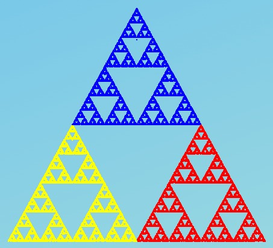
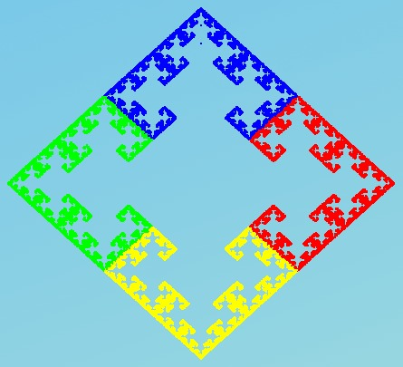
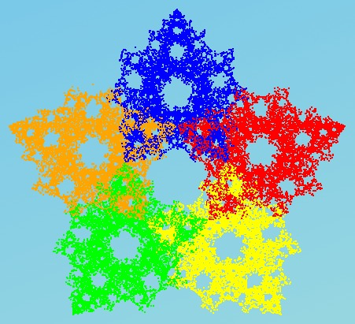
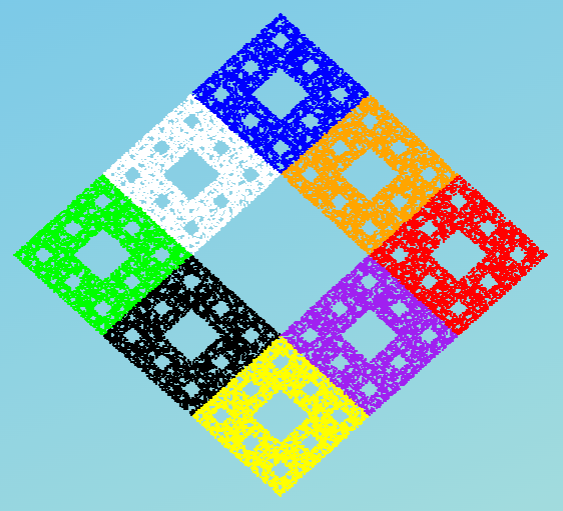

# Chaos Game

------------------------------------------------------------------------

## Membrii echipei

-   Colceru Cosmin
-   Ungureanu Dan-Andrei
-   Nistor Gheorghe

## Descriere

Chaos game este o metodă de a genera fractali cu ajutorul poligoanelor. Regulile sunt simple și vor fi explicate folosind exemplul unui triunghi cu vârfurile A, B și C. Începem cu un punct aleator P1 în interiorul triunghiului. Pentru a calcula următoarul punct P2, alegem unul dintre cele trei vârfuri ale triunghiului la întâmplare și plasăm P2 în mijlocul traseului dintre punctul P1 și vârful selectat aleator. Repetăm acest proces de un număr mare de ori și vom obține fractalul numit triunghiul lui Sierpinski, o figură descrisă pentru prima dată de matematicianul polonez Wacław Sierpiński în 1915.

{width="450px"}

### Generalizare

Acest mecanism de construcție pentru fractali poate fi aplicat oricărui poligon. Cu toate acestea, dacă creștem numărul de vârfuri, nu ar trebui să mai înjumătățim distanța, ci să ajustăm ușor factorul, altfel algoritmul nu va crea întotdeauna un fractal. De exemplu, dacă înjumătățim distanța dintre poziția curentă și vârful selectat aleator al unui pătrat, obținem o zonă umplută uniform cu puncte și nu un fractal.

Distanța care trebuie folosita pentru a obiține un fractal într-un poligon cu n vârfuri poate fi calculată după formula $r=\frac{n}{n + 3}$.

### Restricții la alegerea vârfurilor

Dacă adăugam restricții la alegerea vârfurilor putem obține alte tipuri de fractali. Astfel de restricții pot fi: - un vârf nu poate fi ales de doua ori la rând - dacă un vârf a fost ales, în următoarea iterație nu putem alege unul din vecinii acelui vârf - pe lângă vârfurile poligonului, acum putem alege și mijlocurile laturilor

Adăugând astfel de restricții și modificând valoarea `r`, putem obține astfel de fractali:

{width="450px"}

{width="450px"}

{width="450px"}

{width="450px"}

## Implementarea aplicației

### Librăriile folosite

``` r
library(shiny)
library(shinyjs)
```

### User Interface

``` r
ui <- fluidPage(
  id="body",
  tags$style("
    #body {
      height: 100vh;
      background-color: #0093E9;
      background-image: linear-gradient(160deg, #0093E9 0%, #80D0C7 100%);
    }"
  ),
  div(
    style="
      width: 100%;
      margin-top: 40px;
      width: 100%;
      text-align: center;
    ",
    tags$a(href="https://en.wikipedia.org/wiki/Chaos_game", h1(style="color: black", "Chaos Game"))
  ),
  # Container - 3 coloane 
  div(
    style="
      padding-top: 30px;
      margin: 0 50px;
      display: flex;
      flex-direction: row;
      justify-content: space-around;
      background-color: rgba(255, 255, 255, 0.35);
      border-radius: 25px;
    ",
    # Coloana 1
    div(
      style="
        padding-left: 30px;
      ",
      sliderInput("n", "Number of initial points", min=3, max=10, value=3, width=450),
      sliderInput("nr_points", "The number of points to be generated", min=50, max=50000, value=5000, width=450),
      div(
        style="
            display: flex; 
            align-items: center; 
            width: 120px;
          ", 
        numericInput("r_a", "R", 1, min=1, max=9, value=1),
        HTML('&nbsp'),
        h3('/'),
        HTML('&nbsp'),
        numericInput("r_b", HTML('&nbsp'), 1, min=1, max=9, value=2),
      ),
      selectInput("restriction", "Choose a restriction:",
                  c("No restriction" = 0,
                    "Current vertex cannot be chosen in the next iteration" = 1,
                    "The currently chosen vertex cannot be 2 places away from the previously chosen vertex" = 2,
                    "The current vertex cannot be one place away (clockwise) from the previously chosen vertex" = 3,
                    "The current vertex cannot be one place away (anti-clockwise) from the previously chosen vertex" = 4,
                    "The currently chosen vertex cannot neighbor the previously chosen vertex if the two previously chosen vertices are the same" = 5,
                    "The point can also jump towards the midpoints of the sides" = 6,
                    "The point can also jump towards the center (only for n = 4)" = 7
                  ), width=450),
      checkboxInput("delay", "Delay", FALSE),
      actionButton("generate", label = "Generate"),
    ),
    # Coloana 2 
    div(
      style="
       
      ",
      selectInput("pattern", "Choose a pattern:",
                  c("Sierpinski triangle" = 1,
                    "Sierpinski carpet" = 2,
                    "Vicsek fractal" = 3
                  ), width=300),
      selectInput("dot_color", "Color:",
                  c("Different color for every vertex" = "undefined",
                    "Black" = "black",
                    "Blue" = "blue",
                    "Red" = "red",
                    "Yellow" = "yellow",
                    "Green" = "green",
                    "Orange" = "orange"
                  ), width=300),
      actionButton("show", label = "Show")
    ),
    # Coloana 3
    div(
      style="
        display: flex;
        justify-content: center;
        align-items: center;
      ",
      plotOutput("chaosGamePlot", width="550px", height="550px"),
    ),
  ),
  # footer
  p(
    style="
      position: absolute;
      bottom: 0px;
      left: 0px;
      width: 100%;
      text-align: center;
      font-size: 16px;
    ",
    "© 2023 Colceru Cosmin, Ungureanu Dan-Andrei, Nistor Gheorghe",
  ),
)
```

### Server

``` r
server <- function(input, output) {
  # Apăsăm butonul "Generate"
  observeEvent(input$generate, {
    n <- input$n
    r <- input$r_a/input$r_b
    restriction <- input$restriction
    nr_points <- input$nr_points
    delay <- input$delay
    dot_size = nr_points * 3 / 1000000
    dot_color = input$dot_color
    chaosGame(n, r, restriction, nr_points, dot_size, dot_color, delay)
  })
  
  # Apăsăm butonul "Show"
  observeEvent(input$show, {
    p <- input$pattern
    dot_color = input$dot_color
    if(p == 1){
      chaosGame(3, 1/2, 0, 20000, 0.35, dot_color, FALSE)
    }
    else if (p == 2)
      chaosGame(4, 2/3, 6, 20000, 0.1, dot_color, FALSE)
    else if (p == 3)
      chaosGame(4, 2/3, 7, 20000, 0.1, dot_color, FALSE)
  })

  chaosGame <- function(n, r, restriction, nr_points, dot_size, dot_color, delay){
    cat("Start nr_points=", nr_points, "\n")
    
    initial_points_x <- numeric()
    initial_points_y <- numeric()
    
    # am adăugat 10 culori pentru că fig. geometrică poate avea maxim 10 puncte
    colors_list <- c("blue", "red", "yellow", "green", "orange", "purple", "black", "white", "brown", "salmon")
    # am adăugat culorile punctelor inițiale
    if (restriction == 6)
      colors <- c(colors_list[1:(2*n)])
    else if (restriction == 7)
      colors <- c(colors_list[1:(n + 1)])
    else
      colors <- c(colors_list[1:n])
    # punctele din care este formată figura geometrică inițială
    
    for (i in 1:n) {
      angle =  (i - 1) * 2 * pi / n;
      initial_points_x[i] <- 5 * sin(angle)
      initial_points_y[i] <- 5 * cos(angle)
    }
    
    # putem sari si catre mijlocul unei laturi
    if (restriction == 6) {
      initial_points_x_2 <- numeric()
      initial_points_y_2 <- numeric()
      
      for (i in 1:(n - 1)) {
        initial_points_x_2[i] = (initial_points_x[i] + initial_points_x[i + 1]) / 2
        initial_points_y_2[i] = (initial_points_y[i] + initial_points_y[i + 1]) / 2
      }
      initial_points_x_2[n] = (initial_points_x[n] + initial_points_x[1]) / 2
      initial_points_y_2[n] = (initial_points_y[n] + initial_points_y[1]) / 2
      
      initial_points_x <- append(initial_points_x, initial_points_x_2)
      initial_points_y <- append(initial_points_y, initial_points_y_2)
    }
    else if (restriction == 7) {
      center_x <- (initial_points_x[1] + initial_points_x[3]) / 2
      center_y <- (initial_points_y[1] + initial_points_y[3]) / 2
      
      initial_points_x <- append(initial_points_x, center_x)
      initial_points_y <- append(initial_points_y, center_y)
    }
    
    # în points_x și points_y vom memora toate punctele din interiorul figurii geometrice
    points_x <- numeric()
    points_y <- numeric()
    
    points_x <- append(initial_points_x, points_x)
    points_y <- append(initial_points_y, points_y)
    
    # un punct fixat din interiorul figurii geometrice
    current_x <- initial_points_x[1]
    current_y <- initial_points_y[1] - 1
    
    # am adaugat culoarea primului punct
    colors <- append(colors, colors_list[1])
    
    last_p <- 0
    last_last_p <- 0
    
    # Aici verificam înainte dacă delay-ul este true
    if(FALSE) {
      # chaosGameDelay(n, r, restriction, 100, 1.5, initial_points_x, initial_points_y, colors_list, colors, points_x, points_y, current_x, current_y, last_p, last_last_p)
    } 
    else {
      for(i in 1:nr_points){
        points_x <- append(points_x, current_x)
        points_y <- append(points_y, current_y)
        
        # aleg un punct random din fig. geometrică inițială
        if (restriction == 6)
          p <- sample(1:(2*n), 1)
        else if (restriction == 7)
          p <- sample(1:(n + 1), 1)
        else
          p <- sample(1:n, 1)
        
        # nu poti alege acelasi varf de doua ori la rand
        if (restriction == 1) {
          while (p == last_p) {
            p <- sample(1:n, 1)
          }
        }
        
        # punctul ales nu poate fi la doua pozitii distanta de punctul anterior
        else if (restriction == 2) {
          while ((p - 1) == (last_p + 1) %% n)
            p <- sample(1:n, 1)
          
        }
        
        # punctul ales nu poate fi punctul urmator in sensul acelor de ceasornic
        else if (restriction == 3) {
          while (((p - 1) == last_p %% n)) 
            
            p <- sample(1:n, 1)
        }
        
        # punctul ales nu poate fi punctul urmator in sensul invers acelor de ceasornic
        else if (restriction == 4) {
          while (((p - 1) == (last_p - 2) %% n)) 
            
            p <- sample(1:n, 1)
        }
        
        # daca ultimele doua puncte ales au fost acelasi, punctul ales nu poate fi vecin cu punctul anterior
        else if (restriction == 5) {
          if (last_p == last_last_p)
            while ((p - 1) == last_p %% n || (p - 1) == (last_p - 2) %% n)
              p <- sample(1:n, 1)
        }
        
        last_last_p = last_p
        last_p = p
        
        # îi asociez punctului culoarea corespunzătoare
    
        colors <- append(colors, colors_list[p])
        
        # calculăm un punct nou
        current_x <- current_x + r * (initial_points_x[p] - current_x)
        current_y <- current_y + r * (initial_points_y[p] - current_y)
      }
      
      #debug
      # cat("points_x: ", points_x, "\n")
      # cat("points_y: ", points_y, "\n")

      if(dot_color == "undefined"){
        output$chaosGamePlot <- renderPlot({
          plot(
            points_x,
            points_y,
            xlab = "",
            ylab = "",
            type = "p",
            col = colors,
            pch = 16,
            cex = dot_size,
            xaxt = "n",
            yaxt = "n"
          )
        },
        bg="transparent"
        )
      }
      else {
        output$chaosGamePlot <- renderPlot({
          plot(
            points_x,
            points_y,
            xlab = "",
            ylab = "",
            type = "p",
            col = dot_color,
            pch = 16,
            cex = dot_size,
            xaxt = "n",
            yaxt = "n"
          )
        },
        bg="transparent"
        )
      }
      
      cat(colors)
      cat("Stop \n")
    }
  }
}
```

### Executarea aplicației

``` r
shinyApp(ui = ui, server = server)
```
